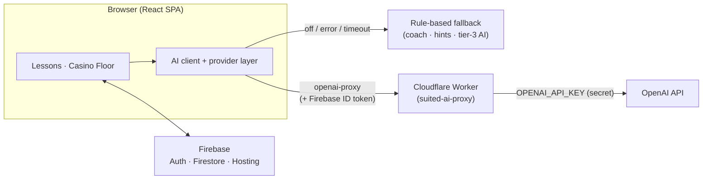

# Suited

> **Learn Texas Hold'em by doing.** An interactive, Brilliant-style course that teaches poker
> through hands-on lessons, then lets you take your skills to a play-money "Casino Floor"
> against rule-based and AI opponents.


Suited is a free-tier web app: the AI is **opt-in**, and every AI feature gracefully falls back
to deterministic, rule-based logic when no model is configured — so the whole experience works
without any paid services.

---

## Table of contents

- [Overview](#overview)
- [Key features](#key-features)
- [Tech stack](#tech-stack)
- [Architecture overview](#architecture-overview)
- [Project structure](#project-structure)
- [Local development](#local-development)
- [Environment variables](#environment-variables)
- [Build & test](#build--test)
- [Deployment](#deployment)
- [Documentation](#documentation)
- [Responsible play](#responsible-play)
- [License](#license)

---

## Overview

**Suited** teaches No-Limit Texas Hold'em the way you actually learn a game — by playing it.
The course is split into **nine hands-on lessons** across **three sections** (Foundations →
Playing a Hand → The Math). Each lesson mixes short concept pages with interactive problems
(deal a board, rank hands, count outs, price a call, size a bet) and ends with a **skill check**
that unlocks the next lesson.

Finish the course and the **Casino Floor** opens: two play-money tables where you put it all
together against opponents — first with an AI coach reading every move, then against
LLM-driven opponents with a strategy hint bar at your side.

Progress, XP, levels, daily streaks, and your play-money bankroll are saved to your account
(Firebase), with a `localStorage` mirror so signed-out play still works. **No real money is
ever involved.**

## Key features

### Nine interactive lessons in three sections

| # | Lesson | Section | What you practice |
|---|--------|---------|-------------------|
| 1 | Poker & the Deck | Foundations | The 52-card deck; deal the board |
| 2 | Hand Rankings | Foundations | Rank hands; compare showdowns |
| 3 | Flow of a Hand | Playing a Hand | Deal the streets; best hand by street |
| 4 | Betting Basics | Playing a Hand | Check, bet, call, raise, fold; sizing |
| 5 | Playing Preflop | Playing a Hand | Open/call/raise/fold; suited vs. offsuit |
| 6 | Outs & Equity | The Math | Count outs; outs → equity % |
| 7 | Pot Odds | The Math | Price a call; call or fold |
| 8 | Expected Value | The Math | EV of a call; fold equity |
| 9 | Bet Sizing & Value Betting | The Math | Value bets; size to the board |

- **Skill checks** gate progression: pass **≥ 2 of 3** questions to mark a lesson complete and
  unlock the next one. Retakes are free and never re-award XP.
- **Rich interactions** rendered from a typed content model: card deck, hand ranker, board
  dealer, outs/odds, betting round, preflop hand, and more — with KaTeX math and drag-and-drop.

### Gamification

- **XP** — 100 base XP on first completion, plus up to **+50** for first-try problem accuracy.
  Awards are **idempotent** (one Firestore transaction guarded by a per-lesson flag), so replays,
  double-taps, and multiple devices never double-count.
- **Levels** — derived from total XP (`xpToNextLevel(level) = 100 + (level − 1) × 25`).
- **Daily streaks** — +1 per qualifying calendar day (Central American Time, UTC−6); missing a
  day resets the displayed streak.

### The Casino Floor — two play-money rooms

| Room | Opponents | Your assist | Blinds · Stack | Unlocks after |
|------|-----------|-------------|----------------|---------------|
| **The Coaching Room** | Rule-based AI (friendly tier-2) | **AI coach** that reacts to every move | 5 / 10 · 500 | Finishing all lessons |
| **The AI Lounge** | **LLM-driven** opponents (tier-3 fallback) | Always-on rule-based **hint bar** | 10 / 20 · 1000 | Clearing the Coaching Room |

Both rooms run on the same pure hand engine (blinds, four betting rounds, side pots, correct
showdowns). A **play-money bankroll** (1,000 chips, granted once) carries between hands, with a
**Rebuy** so you can never hard-lock. Everything works with AI off — the coach falls back to a
rule-based read and the LLM opponents fall back to a deterministic tier-3 strategy.

### Accounts & profile

- **Sign in with Google or email/password**, with **username-based login**.
- First-run **profile setup** (unique username + a poker-themed avatar — suits, chip, cards,
  dealer button, ace; the stored field is still named `profileAnimal` for back-compat).
- **Account settings**: change email (verify-before-update), change/Set password,
  link email-password to a Google account, and rename your username.

## Tech stack

| Layer | Technology |
|-------|------------|
| Frontend | **React 19** + **Vite** + **TypeScript** |
| Styling | **Tailwind CSS v4** |
| Routing | React Router |
| Math & content | **KaTeX** via `react-markdown` + `remark-math` + `rehype-katex` |
| Drag & drop | **@dnd-kit** (core / sortable / utilities) |
| Auth & data | **Firebase** Authentication + Cloud Firestore |
| Hosting | **Firebase Hosting** (SPA) |
| AI (default) | **Firebase AI Logic** (Gemini) — opt-in, with rule-based fallback |
| AI (secure OpenAI) | **Cloudflare Worker** proxy (free-tier), Firebase-ID-token gated |
| Testing | **Vitest** |

> **Free-tier by design.** The OpenAI path runs through a Cloudflare **Worker** (free Workers
> plan) rather than a Firebase Cloud Function, because Functions require the paid **Blaze** plan.
> Firebase stays on the free **Spark** plan.

## Architecture overview

Suited is a single-page React app with two pure, framework-free engines and a pluggable AI layer.

- **Lesson engine** — lessons and skill checks are typed data (`web/src/data/lessons`,
  `web/src/data/skillChecks`) rendered by a lesson player and interaction components. Progress,
  XP, streaks, and unlock gating are computed in `web/src/lib` and persisted to Firestore (with a
  `localStorage` mirror).
- **Poker engine** — `web/src/lib/poker` holds a React-free, deterministic Texas Hold'em state
  machine (`handEngine`), a hand evaluator (`handEvaluator`), rule-based opponents in three tiers
  (`opponentAI`), and an always-on rule-based hint generator (`hints`). All randomness flows
  through a seeded RNG, so a given seed always replays the same hand.
- **Casino runtime** — `web/src/components/table/tableRuntime` adapts the engine to the two rooms,
  wiring opponents to either the rule AI or the LLM, and the hero to either the coach or the hint
  bar. It also owns the play-money bankroll and the unlock gating.
- **AI layer** — `web/src/lib/ai` exposes a crash-proof client over a **pluggable provider**
  (`gemini` | `openai` | `anthropic` | `openai-proxy`). The default is Gemini (Firebase AI Logic).
  Every call **soft-fails to `null`** on error/timeout/misconfiguration, so the coach, table talk,
  and LLM opponents always fall back to deterministic rule-based logic. **The AI is opt-in** — with
  nothing configured, the app behaves exactly as the rule-based experience.
- **Secure OpenAI proxy** — the `openai-proxy` provider calls the Cloudflare **Worker** in
  `worker/`. The OpenAI API key lives **only** in a Worker secret and is **never** shipped to the
  browser; the Worker verifies the caller's Firebase ID token, enforces a **server-side model
  allow-list** and **per-uid rate limits** (a per-minute burst guard + daily cap, backed by a
  SQLite Durable Object that `wrangler deploy` creates automatically), and applies tight input
  caps before proxying to OpenAI.
- **Firebase** — Authentication (Google + email/password), Cloud Firestore (per-user profile,
  gamification, and lesson progress), and Hosting for the built SPA.



For the deep dive, see **[docs/ARCHITECTURE.md](docs/ARCHITECTURE.md)**.

## Project structure

```
.
├── README.md                  # You are here
├── firebase.json              # Hosting + Firestore config
├── firestore.rules            # Firestore security rules
├── firestore.indexes.json     # Firestore indexes (none required yet)
├── .firebaserc                # Default Firebase project
├── docs/                      # Architecture, deployment, design & QA notes
│   ├── ARCHITECTURE.md
│   ├── DEPLOYMENT.md
│   └── …                      # poker-course-design, security-fixes, qa-review, research
├── scripts/
│   └── add-auth-domains.mjs   # Helper: add Firebase Auth authorized domains
├── web/                       # The React app
│   ├── .env.example           # Copy to .env.local with your Firebase config
│   ├── package.json
│   ├── scripts/
│   │   └── mvp-logic-check.mjs # Auth-free logic checks
│   └── src/
│       ├── data/              # lessons/, skillChecks/, course, tables, glossary, animals
│       ├── components/
│       │   ├── lesson/        # lesson player + interactions/
│       │   └── table/         # casino UI + tableRuntime
│       ├── lib/
│       │   ├── poker/         # handEngine, handEvaluator, opponentAI, hints
│       │   └── ai/            # aiClient + providers/ (gemini/openai/anthropic/openai-proxy)
│       ├── contexts/          # AuthContext
│       └── pages/             # Home, Course, Lesson, SkillCheck, Table, Profile, auth
└── worker/                    # Cloudflare Worker: secure OpenAI proxy
    ├── README.md
    ├── wrangler.toml          # Worker config + RateLimiterDO Durable Object binding/migration
    └── src/                   # index.ts, firebaseAuth.ts, openai.ts, rateLimit.ts, rateLimiterDO.ts
```

## Local development

**Prerequisites:** Node.js 20+ and npm, plus a Firebase project (a free Spark project is enough).

```bash
# 1) Clone and enter the web app
git clone <your-repo-url>
cd <repo>/web

# 2) Install dependencies
npm install

# 3) Create your local env file from the template
cp .env.example .env.local
#    then fill in your Firebase Web app config (see the table below)

# 4) Start the dev server
npm run dev
```

Open the URL Vite prints (default **http://localhost:5173**). Use `localhost` rather than
`127.0.0.1` unless both are in your Firebase **authorized domains**.

> **Google sign-in locally:** add `localhost` under
> **Firebase Console → Authentication → Settings → Authorized domains**. The Firebase CLI does
> not add authorized domains automatically; you can also run `node scripts/add-auth-domains.mjs`
> from the repo root (requires `firebase login`). See [`web/README.md`](web/README.md) for details.

With no AI provider configured, all AI features use the built-in rule-based fallback — the app is
fully functional out of the box.

## Environment variables

All client variables are build-time **Vite** vars (prefixed `VITE_`) and live in `web/.env.local`
(gitignored). Start from [`web/.env.example`](web/.env.example).

### Firebase (required)

| Variable | Required | Description |
|----------|:--------:|-------------|
| `VITE_FIREBASE_API_KEY` | ✅ | Firebase Web app API key |
| `VITE_FIREBASE_AUTH_DOMAIN` | ✅ | e.g. `your-project-id.firebaseapp.com` |
| `VITE_FIREBASE_PROJECT_ID` | ✅ | e.g. `your-project-id` |
| `VITE_FIREBASE_STORAGE_BUCKET` | – | e.g. `your-project-id.firebasestorage.app` |
| `VITE_FIREBASE_MESSAGING_SENDER_ID` | – | Cloud Messaging sender id |
| `VITE_FIREBASE_APP_ID` | ✅ | Firebase Web app id |

### AI provider (optional — opt-in)

| Variable | Description |
|----------|-------------|
| `VITE_LLM_PROVIDER` | `gemini` (default) · `openai` · `anthropic` · `openai-proxy`. Auto-detected from keys if unset. |
| `VITE_AI_PROXY_URL` | Deployed Cloudflare Worker URL for the secure OpenAI proxy (e.g. `https://suited-ai-proxy.<subdomain>.workers.dev`). The client appends `/chat` automatically. |
| `VITE_OPENAI_MODEL` | Optional model override (the Worker defaults to `gpt-4o-mini`). |
| `VITE_OPENAI_API_KEY` / `VITE_ANTHROPIC_API_KEY` | Direct browser-side keys for the `openai` / `anthropic` providers. **Exposed in the bundle** — for production prefer the Worker proxy. |
| `VITE_RECAPTCHA_SITE_KEY` | Optional: enables Firebase **App Check** (reCAPTCHA Enterprise). |

> **The OpenAI key is never a client variable.** It is stored as a **Worker secret**
> (`OPENAI_API_KEY`) and only ever read server-side by the Cloudflare Worker. See
> [Deployment](#deployment) and [`worker/README.md`](worker/README.md).

To turn on the secure OpenAI path, deploy the Worker, then set both:

```bash
# web/.env.local
VITE_LLM_PROVIDER=openai-proxy
VITE_AI_PROXY_URL=https://suited-ai-proxy.<your-subdomain>.workers.dev
```

## Build & test

Run from the `web/` directory:

```bash
# Production build (type-checks via `tsc -b`, then bundles to web/dist)
npm run build

# Unit tests (engine, AI guard-rails, gamification, auth helpers, …)
npx vitest run

# Type-check the app without emitting
tsc -p tsconfig.app.json --noEmit

# Auth-free logic checks (unlock gating, sessions, XP math, …)
node scripts/mvp-logic-check.mjs
```

## Deployment

A full, copy-pasteable runbook lives in **[docs/DEPLOYMENT.md](docs/DEPLOYMENT.md)**. In short:

**1) Firebase Hosting + Firestore rules** (from the repo root, after `firebase login`):

```bash
cd web && npm run build && cd ..
firebase deploy --only hosting,firestore:rules
```

**2) The AI Worker** (optional — only needed for the secure OpenAI path), from `worker/`:

```bash
cd worker
npm install
npx wrangler login
npx wrangler secret put OPENAI_API_KEY     # paste your sk-... key when prompted (never commit it)
npx wrangler deploy                        # note the printed https://suited-ai-proxy.<subdomain>.workers.dev
```

**3) Wire the client to the Worker** — set `VITE_AI_PROXY_URL` + `VITE_LLM_PROVIDER=openai-proxy`
in `web/.env.local`, then rebuild and redeploy hosting.

## Documentation

| Doc | What's in it |
|-----|--------------|
| [docs/ARCHITECTURE.md](docs/ARCHITECTURE.md) | Lesson/skill-check content model, poker engine, casino runtime, AI layer, Firebase data model & rules |
| [docs/DEPLOYMENT.md](docs/DEPLOYMENT.md) | Step-by-step deploy runbook (Firebase + Cloudflare Worker) and free-tier notes |
| [worker/README.md](worker/README.md) | The Cloudflare Worker OpenAI proxy (endpoints, auth, CORS, deploy) |
| [web/README.md](web/README.md) | Web-app setup, Google-sign-in notes, progress schema |
| [docs/poker-course-design.md](docs/poker-course-design.md) | The course/pedagogy design |
| [docs/poker-sections-design.md](docs/poker-sections-design.md) | The sectioned learning path design |
| [docs/security-fixes.md](docs/security-fixes.md) | Pre-production security hardening notes |
| [docs/qa-review.md](docs/qa-review.md) | Product-experience QA review |

## Responsible play

Suited is for **learning** Texas Hold'em strategy and mechanics. All chips, bankrolls, and casino
tables use **play money only** — there is no real wagering, no cash-out, and no integration with
any gambling service. The goal is sharper instincts and a solid grasp of the math, not gambling.

## License

This is a private, educational project (the `web/` and `worker/` packages are marked `private`),
and no open-source license is currently included. Treat the code as all-rights-reserved unless a
`LICENSE` file is added.
