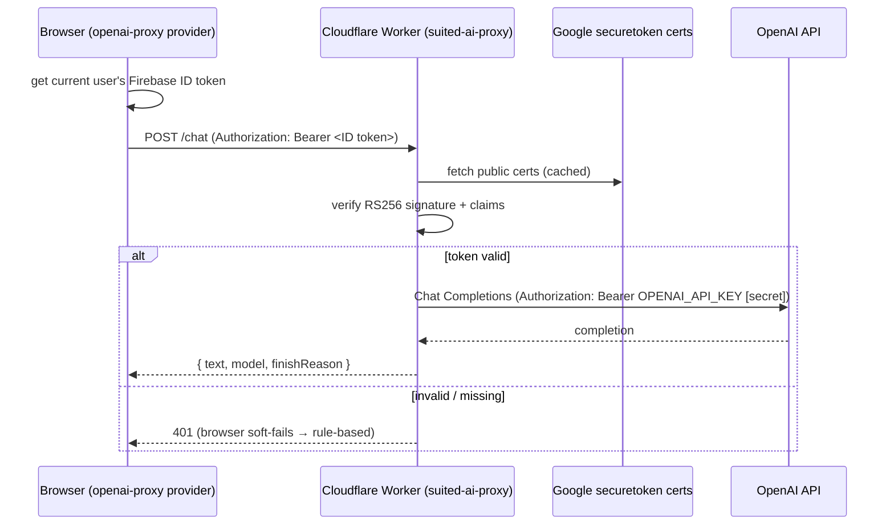

# Architecture

This document is the deep dive into how **Suited** is built. For a high-level tour and setup
instructions, start with the root [README](../README.md); for deploy steps, see
[DEPLOYMENT.md](DEPLOYMENT.md).

Suited is a single-page React app (`web/`) backed by Firebase, with an optional Cloudflare Worker
(`worker/`) that proxies OpenAI. Two of its cores — the **lesson engine** and the **poker
engine** — are pure, framework-free TypeScript, which keeps them deterministic and unit-testable.
The **AI layer** is pluggable and always degrades to rule-based logic.

## Table of contents

- [High-level layout](#high-level-layout)
- [The lesson engine](#the-lesson-engine)
  - [Content model](#content-model)
  - [Interaction components](#interaction-components)
  - [Lesson player, progress & gamification](#lesson-player-progress--gamification)
- [The poker engine](#the-poker-engine)
  - [Hand state machine](#hand-state-machine-handengine)
  - [Hand evaluator](#hand-evaluator-handevaluator)
  - [Rule-based opponents](#rule-based-opponents-opponentai)
- [The casino runtime](#the-casino-runtime)
- [The AI layer](#the-ai-layer)
  - [Client & provider abstraction](#client--provider-abstraction)
  - [Coach, opponents & hints](#coach-opponents--hints)
  - [The Cloudflare Worker proxy](#the-cloudflare-worker-proxy)
  - [The fallback chain](#the-fallback-chain)
- [Firebase](#firebase)
  - [Authentication](#authentication)
  - [Firestore data model](#firestore-data-model)
  - [Security rules](#security-rules)
  - [Hosting](#hosting)
- [Design principles](#design-principles)

## High-level layout

```
web/src
├── data/            # Pure content: lessons, skill checks, course/sections, casino tables, glossary
├── types/           # Shared domain types (lesson, skillCheck, poker)
├── components/
│   ├── lesson/      # LessonPlayer, SkillCheckPlayer, step views, InteractionRenderer
│   │   └── interactions/   # One component per interactive problem type
│   ├── table/       # PokerTable, Seat, ActionControls, CoachPanel, HintBar, tableRuntime
│   └── ui/          # Buttons, layout, badges, etc.
├── lib/
│   ├── poker/       # handEngine, handEvaluator, opponentAI, hints, rng (pure, tested)
│   ├── ai/          # aiClient + providers/ (pluggable LLM layer)
│   ├── gamification.ts, bankroll.ts, lessonProgress*.ts, userProfile.ts, …
│   └── firebase.ts  # Firebase app, auth, Firestore, Gemini model, optional App Check
├── contexts/        # AuthContext
└── pages/           # Home, Course, Lesson, SkillCheck, Table, Profile, Login, SignUp, ProfileSetup
```

Routing (`web/src/App.tsx`) is a React Router tree under a shared `Layout`, split into
guest-only routes (`/login`, `/signup`), a profile-setup gate (`/setup-profile`), and
protected routes (`/`, `/course`, `/lesson/:lessonId`, `/lesson/:lessonId/skill-check`,
`/table/:id`, `/profile`). The course, lesson, skill-check, and table pages are lazy-loaded.

## The lesson engine

### Content model

Lessons and skill checks are **typed data**, not code paths — authoring a lesson means writing a
`LessonDefinition`, never touching the renderer. The model lives in `web/src/types/lesson.ts`:

- A `LessonDefinition` is `{ id, title, steps[] }`.
- A `LessonStep` is either a **`ConceptStep`** (markdown/KaTeX prose, with an optional small
  `visual`) or a **`ProblemStep`**.
- Every `ProblemStep` extends `ProblemStepBase` (`id`, `prompt`, `feedback`, optional
  `showCalculator`) and is discriminated by its `interaction` field. The shipped interaction
  variants are:

  | `interaction` | Purpose |
  |---------------|---------|
  | `card-deck` | Select cards from the 52-card deck; confirm `|A|` and `P(A)` |
  | `compare-events` | Decide which of two events is more likely |
  | `hand-ranker` | Identify / order / build / pick-best-five hand categories |
  | `board-dealer` | Deal streets, name the best hand, judge a showdown |
  | `outs-odds` | Count outs → equity → pot odds → call/fold decision |
  | `betting-round` | Choose an action, choose a size, or compute EV of a call |
  | `hand-ranking-ladder` | Explore the 10 categories (reveal-gated, non-graded) |
  | `preflop-hand` | Classify a starting hand or pick the stronger of two |

  Each variant pairs a `config` (what to render) with an `answer` (how to grade). Lesson files
  live in `web/src/data/lessons/` (`lesson-1.ts` … `lesson-8.ts` plus `lesson-preflop.ts`).

- **Skill checks** (`web/src/types/skillCheck.ts`) reuse the exact same problem types: a
  `SkillCheckQuestion` is a `ProblemStep` minus `type`/`feedback`, plus optional
  `incorrectFeedback`. They live in `web/src/data/skillChecks/`.

The course shape itself is data too: `web/src/data/course.ts` (branding) and
`web/src/data/lessons.ts` (the nine-lesson, three-section path plus the two casino nodes). A
helper `lessonNumber(id)` maps the internal ids to the displayed 1–9 ordering (so the inserted
`preflop` lesson shows as **5**), and casino nodes (`kind: 'ai-table'`) are excluded from lesson
numbering and XP math.

### Interaction components

`web/src/components/lesson/interactions/` holds one presentational component per problem type
(`CardDeck`, `CompareEvents`, `HandRanker`, `BoardDealer`, `OutsOdds`, `BettingRound`,
`HandRankingLadder`, `PreflopHand`), plus shared helpers — a numeric/fraction answer kit,
a scratchpad `Calculator`, a `CheckPanel`, playing-card visuals (`cards/PlayingCardKit`), and a
reduced-motion hook. `InteractionRenderer` dispatches a `ProblemStep` to the right component, and
the poker interactions grade against the **same** `handEvaluator` the engine uses, so a lesson can
never disagree with the casino about what beats what.

### Lesson player, progress & gamification

`LessonPlayer` (`web/src/components/lesson/`) walks a learner through a lesson's steps, tracks
per-problem submit counts, and persists an in-progress **session** so a mid-lesson exit resumes
where you left off. `SkillCheckPlayer` runs the gating quiz.

Progress is layered:

- **Lesson progress** (`web/src/lib/lessonProgress*.ts`) records `attempted`, `lessonFinished`,
  `completed`, accuracy, skill-check score, pending attempts, and the XP breakdown for a lesson.
  Firestore is the source of truth for signed-in users; everything is mirrored to `localStorage`
  (session saves are debounced) so signed-out play still works and survives reloads. On sign-in,
  `progressSync` reconciles local → remote once if the account has no remote progress yet.
- **Gamification** (`web/src/lib/gamification.ts`) is pure math:
  - `computeLessonXp(attempts, problemIds)` → `100` base + `max(0, 50 − extraAttempts × 10)` bonus.
  - `levelFromTotalXp` / `xpToNextLevel(level) = 100 + (level − 1) × 25`.
  - `computeStreakAfterCompletion` / `getEffectiveStreak` track a daily streak in **Central
    American Time** (`America/Guatemala`, UTC−6).
  - Pass policy: `isSkillCheckPassing(correct, total)` requires **≥ 2/3**.
- **Award path** — completing a lesson + passing its skill check runs a single Firestore
  transaction (`awardLessonCompletion`) that marks the lesson `completed`, sets an `xpAwarded`
  idempotency flag, adds XP only on first completion, and advances the streak at most once per
  day. Review-only activity advances the streak without re-awarding XP. A `gamification-updated`
  event refreshes the profile UI.
- **Unlock gating** — lessons unlock sequentially; the Casino Floor unlocks only after the whole
  course is complete (and Room 2 only after Room 1).

## The poker engine

Everything in `web/src/lib/poker/` is **pure and deterministic** — no React, no I/O, all
randomness through a seeded RNG (`rng.ts`, mulberry32 + Fisher–Yates). This is what powers the
casino tables and is exercised directly by unit tests (`*.test.ts`).

### Hand state machine (`handEngine`)

`handEngine.ts` owns a single hand of multiway No-Limit Hold'em as an immutable `HandState`.
`applyAction` never mutates its input — it returns a brand-new state — so React renders and any
accidental double-fire are safe.

- `createHand(config)` — posts blinds (heads-up: the button posts the small blind), deals hole
  cards one at a time from the small blind, and sets first-to-act.
- `legalActions(state)` — the legal moves for the seat to act (`check`/`bet` when nothing is owed,
  `fold`/`call`/`raise` when facing a bet), with `min`/`max` expressed as **total** street
  commitment ("bet to / raise to X"); includes the big-blind option.
- `applyAction(state, action)` — applies `fold`/`check`/`call`/`bet`/`raise`, tracks
  `minRaise` (short all-in raises don't re-open action), and advances the turn. When a betting
  round closes it deals the next street (burning a card first), or moves to showdown.
- `runShowdown` / `settle` — builds correct **side pots** from each seat's `totalCommitted`,
  decides winners per layer via the evaluator, splits ties, and routes odd chips to the first
  seat left of the button. Uncontested pots are awarded without a showdown.

### Hand evaluator (`handEvaluator`)

`handEvaluator.ts` is the pure best-five-of-seven evaluator used by both lessons and the engine:
`evaluateHoldem(hole, board)`, `evaluateBest(cards)`, `compareHands`, `countOuts`, and helpers
like `holeCardsImproveBoard` (used to detect "playing the board" — when the made hand is entirely
on the community cards). Cards are simple `CardId` strings (e.g. `"AS"`, `"10H"`, `"KD"`).

### Rule-based opponents (`opponentAI`)

`opponentAI.ts` provides `decideAI(input)` in three tiers, all pure and seeded:

- **Tier 1 — Calling station:** never bluffs, never folds a made hand, calls draws.
- **Tier 2 — TAG (tight-aggressive):** pot-odds-aware; value-bets strong hands, occasional bluff.
- **Tier 3 — Tighter, position-aware TAG:** thinner value in position, tighter multiway, balanced
  bluff frequency; this is also the deterministic fallback for the LLM opponents.

Strength comes from the evaluator plus a lightweight draw/equity model (flush + straight outs via
the rule of 2 & 4). A `finalize` guard forces every decision into `legalActions` and clamps any
bet/raise amount to that action's `[min, max]`, so the AI can never produce an illegal move.

## The casino runtime

`web/src/components/table/tableRuntime.ts` is the glue between the pure engine and the AI layer.
The two rooms are pure data in `web/src/data/tables.ts`:

| Field | Room 1 — "The Coaching Room" | Room 2 — "The AI Lounge" |
|-------|------------------------------|--------------------------|
| `feature` | `coached` | `ai` |
| Opponents | Rule AI (`decideAI`) | LLM (`decideWithLLM`) + tier-3 fallback |
| Hero assist | AI **coach** (reacts to every move) | Rule-based **hint bar** (no coach) |
| `tier` | 2 | 3 (fallback) |
| Seats | Sticky Pete, Steady Sam | Ace, Nadia, Sol |
| Blinds · stack | 5 / 10 · 500 | 10 / 20 · 1000 |
| `prereqId` | lesson `8` (whole course) | `room-1` |

`toRuntimeConfig(table)` derives the runtime wiring (`opponentSource: 'rule' | 'llm'`,
`support: 'coach' | 'hints'`). The module builds the per-decision context objects each Ai/hint
function needs (position, live opponent count, a deterministic per-spot RNG), and maps decisions
back into the engine's `AppliedAction`:

- `decideRuleAction` — synchronous tier decision for Room 1 opponents.
- `decideLLMAction` — Room 2 opponents; calls `decideWithLLM` with an **injected** tier-3
  `decideAI` fallback, so a hand always plays start to finish even with AI off.
- `coachReactionFor` / `coachResultReaction` — Room 1's pure, AI-free coaching reactions (in the
  moment, and a result-aware end-of-hand reflection), derived from `analyzeSpot` + the tier-3
  recommendation. They handle subtleties like "playing the board" and frame a well-priced losing
  call as variance rather than a mistake.
- Hand lifecycle helpers (`createInitialHand`, `createNextHand`, `finalizeHand`,
  `summarizeHand`, `groupHandLog`, `roleFor`) carry stacks between hands, drop busted seats,
  rotate the button, and produce a clean per-street hand log.

**Bankroll** (`web/src/lib/bankroll.ts`) is per-account **play money**: a `STARTING_BANKROLL` of
1,000 chips is granted exactly once (idempotently — guarded by `users/{uid}.bankrollGranted`),
follows the hero's stack after each hand, and can be topped back up via **Rebuy** so play money
never hard-locks. Like gamification, it is Firestore-backed for signed-in users with a
`localStorage` mirror.

## The AI layer

`web/src/lib/ai/` is a thin, **crash-proof** wrapper around a swappable LLM provider. Its guiding
rule: **AI is opt-in and every call can fail silently.** Callers get `null`/`false` on any
problem and fall back to deterministic logic, so the product never depends on a model being
available.

### Client & provider abstraction

- `aiClient.ts` exposes `isAIConfigured()`, `generateText()`, and `generateJSON()`. It enforces an
  ~8s timeout (aborting the underlying fetch), and `generateJSON` parses defensively — tolerating
  Markdown code fences and surrounding prose around the JSON body. Any
  error/timeout/misconfiguration resolves to `null`.
- `providers/index.ts` defines the `LLMProvider` interface (`id`, `isConfigured()`,
  `generateText()`) and selects the active provider:
  1. explicit `VITE_LLM_PROVIDER` (`gemini` | `openai` | `anthropic` | `openai-proxy`) wins;
  2. else auto-detect from `VITE_OPENAI_API_KEY` / `VITE_ANTHROPIC_API_KEY`;
  3. else default to **`gemini`** (Firebase AI Logic).
- Providers:
  - **`gemini`** — Firebase AI Logic (`getGeminiModel()` in `lib/firebase.ts`, model
    `gemini-flash-latest`); returns `null` when the project isn't provisioned.
  - **`openai`** / **`anthropic`** — direct browser-side calls using a `VITE_*_API_KEY`. Convenient
    for local experiments, but the key ships in the bundle — **not** recommended for production.
  - **`openai-proxy`** — the secure path (below). Opt-in only (never auto-selected); "configured"
    means `VITE_AI_PROXY_URL` is set.

### Coach, opponents & hints

- **Coach** (`coach.ts`) — `getCoachTip` returns one grounded, concept-naming sentence; the
  "ask for more" `getDeepCoachTip` returns a structured, numbers-driven read of the whole table.
  Both build a prompt grounded in the real spot (`analyzeSpot` facts, glossary definitions, legal
  actions) and **fall back to the rule-based hint/breakdown** on any failure, so the coach always
  responds.
- **LLM opponents** (`llmOpponent.ts`) — `decideWithLLM` asks for a JSON decision, then
  **validates and clamps** it against the exact legal actions (illegal action, bad/out-of-range
  amount, bad JSON → rejected). Any problem resolves to the caller-injected deterministic
  fallback. It deliberately does **not** import the engine — the strategy is injected — keeping
  the LLM layer independently compilable. `getTableTalk` adds optional in-character flavor.
- **Hints** (`lib/poker/hints.ts`) — the always-on, pure rule-based coach. `analyzeSpot` reads
  made hand / outs / equity / pot odds and produces both the human `tip` and the `facts` that
  ground the AI prompts. This is what powers Room 2's hint bar and every AI fallback.

### The Cloudflare Worker proxy

`worker/` is a tiny, free-tier Cloudflare Worker (`suited-ai-proxy`) that exists so OpenAI can be
used **without** the OpenAI key ever reaching the browser — and without a paid Firebase Blaze
plan (Cloud Functions require Blaze; this project moved to a Worker to stay on the free tier).

- **`POST /chat`** — requires `Authorization: Bearer <Firebase ID token>`. It verifies the token,
  validates the body (`{ model?, messages, temperature?, max_tokens?, json? }`), calls OpenAI
  Chat Completions with the server-side `OPENAI_API_KEY` secret, and returns
  `{ text, model, finishReason }`. Default model `gpt-4o-mini`.
- **`GET /` or `/health`** — unauthenticated liveness probe → `{ "status": "ok" }`.
- **CORS** — an allowlist of the production hosting domains and local dev origins
  (`ALLOWED_ORIGINS` in `src/index.ts`).
- **Token verification** (`src/firebaseAuth.ts`) — Firebase ID tokens are RS256 JWTs, verified
  with **Web Crypto only** (zero runtime deps): fetch Google's securetoken x509 certs (cached per
  `Cache-Control`), match the `kid`, slice the SPKI out of the certificate's DER, verify the
  signature, and check claims (`aud`/`iss` = project id, `exp` not expired, plus light
  `iat`/`auth_time`/`sub` checks). Anything off → `401`.
- **Secret** — `OPENAI_API_KEY` is set with `wrangler secret put` and is never committed, logged,
  or echoed. The Worker config (`wrangler.toml`) enables observability and declares no other
  bindings.



### The fallback chain

Putting it together, every AI feature degrades gracefully:

```
LLM provider (gemini | openai | anthropic | openai-proxy)
        │  null on: AI off · not signed in (proxy) · network/server error · timeout · bad output
        ▼
Rule-based logic  (coach → analyzeSpot tip/breakdown;  opponents → injected tier-3 decideAI;
                   Room 2 hero → always-on hint bar)
```

So with **no** provider configured (the default once Gemini is unprovisioned), the entire app —
lessons, coach, opponents, hints — runs on deterministic rule-based logic.

## Firebase

`web/src/lib/firebase.ts` initializes the Firebase app from the `VITE_FIREBASE_*` env vars and
exports `auth`, `db` (Firestore), and a lazily-built Gemini model. **App Check** (reCAPTCHA
Enterprise) is wired up only when `VITE_RECAPTCHA_SITE_KEY` is present, inside a try/catch so a
missing key never breaks startup. The active project is `brilliant-alpha-clone-54be9`
(`.firebaserc`).

### Authentication

`web/src/contexts/AuthContext.tsx` wraps Firebase Auth and exposes the whole auth surface:

- **Sign-up / sign-in** with email/password and **Google** (popup).
- **Username login** — `signInWithUsername` resolves a username → email via the `usernames`
  index, then signs in. A generic error avoids leaking whether a username exists.
- **Account settings** — `changeEmail` (via `verifyBeforeUpdateEmail`, so the address only flips
  after the user confirms the link), `changePassword`, `linkEmailPassword` (attach an
  email/password credential to a Google account, re-authenticating via Google if Firebase
  requires a recent login), and a shared `reauthenticate` flow.
- **Profile reconciliation** — when the live auth email no longer matches the stored profile
  email (after a verified email change), the profile and `usernames` doc are reconciled to the
  new, lowercased address.
- A test-only **E2E auth bypass** is gated behind `import.meta.env.DEV` (so it can never ship in a
  `vite build`) and performs no Firestore writes.

### Firestore data model

| Path | Purpose | Key fields |
|------|---------|-----------|
| `users/{uid}` | Per-account profile + gamification + bankroll | `email`, `username`, `profileAnimal`, `profileComplete`, `level`, `totalXp`, `streak`, `lastActivityDate`, `chips`, `bankrollGranted`, `createdAt` |
| `users/{uid}/lessonProgress/{lessonId}` | Per-lesson progress | `attempted`, `lessonFinished`, `completed`, `lessonAccuracy`, `skillCheckCorrect`/`Total`, `xpAwarded`, `session`, `updatedAt`, … |
| `usernames/{name}` | Username → account lookup for login | `uid`, `email` (lowercased) |

The `usernames/{name}` docs are a uniqueness index: signup and username changes claim/release them
inside the same transaction that updates `users/{uid}.username`, so a name is never double-claimed
or orphaned. No composite indexes are required (`firestore.indexes.json` is empty).

### Security rules

`firestore.rules` enforces least privilege:

- **`users/{uid}`** — owner-only read/write. Writes must pass a **field whitelist**
  (`validUserFields`) and **gamification validation** (`validGamificationFields` — types and
  bounds for `level`/`totalXp`/`streak`/`lastActivityDate`/`chips`/`bankrollGranted`). On update,
  identity fields are constrained: `email` may only be set to the caller's **verified token
  email** (or left unchanged), and `username` may change to any string or null (uniqueness is
  enforced by the index docs).
- **`users/{uid}/lessonProgress/{lessonId}`** — owner-only read/write.
- **`usernames/{name}`** — single-doc `get` is public (so the login form can resolve a username),
  but `list` is **denied** (no bulk harvesting). `create`/`update` are pinned to the caller's own
  `uid` and **verified token email** with an exact `{uid, email}` key set; `delete` is allowed
  only for a doc that points to the caller's own `uid` (so a rename can release the old name).

These reflect the C1/M1/M2/L1 hardening described in [security-fixes.md](security-fixes.md).
Editing `firestore.rules` has no effect until deployed (see [DEPLOYMENT.md](DEPLOYMENT.md)).

### Hosting

`firebase.json` serves the built SPA from `web/dist` with a catch-all rewrite to `/index.html`.
HTML is sent `no-cache` while hashed `/assets/**` get a one-year immutable cache. The `auth`
block declares the email/password and Google providers and the local authorized redirect URIs.

## Design principles

- **Pure cores, deterministic by seed.** The lesson and poker engines are framework-free and
  seedable, so behavior is reproducible and easy to test.
- **AI is opt-in and never load-bearing.** Every AI call soft-fails to rule-based logic; the app
  is fully functional with no model configured.
- **Secrets never touch the client.** The OpenAI key lives only in a Worker secret; the browser
  authenticates to the Worker with a Firebase ID token.
- **Free-tier first.** Firebase Spark + a free Cloudflare Worker, no Blaze plan, no paid
  dependencies required to run the whole experience.
- **Single source of truth for poker.** Lessons, hints, coach, and the casino all evaluate hands
  with the same `handEvaluator`, so the math is consistent everywhere.
